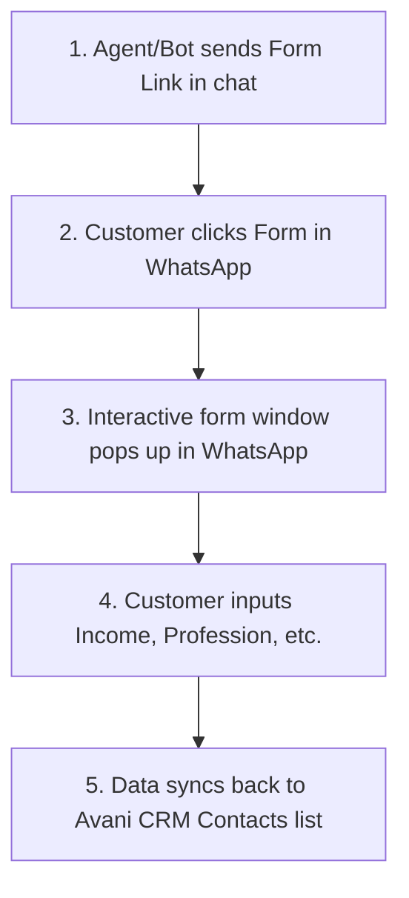

# WhatsApp Forms - Operational & Integration Guide

This guide explains how to build, send, and automate interactive **WhatsApp Forms** inside your CRM to collect customer loan requirements (Income, Profession, Loan Amount) directly inside their WhatsApp chat.

---

## 🛠️ Step 1: How to Create a Form in your CRM
1. Go to your live CRM page: [WhatsApp Forms](https://frontend-liart-gamma-68.vercel.app/forms).
2. Click **+ Add WhatsApp Form**.
3. Enter a descriptive name for your form (e.g., `personal_loan_qualification` or `home_loan_kyc`).
4. Once added, the CRM creates the form configuration and assigns the default collection fields schema: `name, phone, income, profession`.

---

## 🔄 Step 2: The Flow - How It Works
Here is the step-by-step lifecycle of how a form works once it is created in your CRM:

### 1. Sending the Form
* **Auto-Pilot Mode (FAQ / AI Assistant):** When a user asks about loan eligibility, the AI automatically drops the form link in their chat.
* **Manual Mode (Inbox/Chatbot):** Your support team can copy the generated form template trigger code and paste it into the active customer conversation.

### 2. Customer Action
* The customer receives a message with a button: **"Fill Application Form"**.
* When they click the button, an interactive form layout pops up directly inside the WhatsApp app (no external browser redirects!).

### 3. Automatic Data Sync
* As soon as the customer clicks **Submit** inside WhatsApp, Meta triggers your Webhook endpoint.
* Your CRM catches the event, parses the inputs, and automatically updates the respective contact record under **Contacts** (e.g., updates their `income`, `profession`, and sets status to `BANK_PROCESSING`).

---

## 3️⃣ Next Steps to Integrate with your Products
To customize forms for your products:
* **Salary Loans:** Gather fields like `monthly_income` and `company_name`.
* **Professional / CA Loans:** Gather fields like `cobil_score` and `degree_registration`.
* **Education Loans:** Gather fields like `co_sign_income` and `target_university`.
